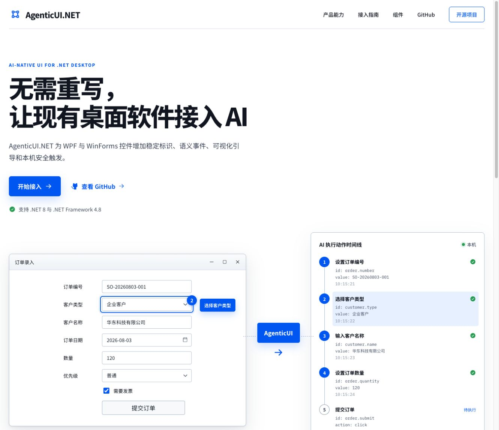

# AgenticUI.NET

[](https://github.com/Z18393520308/AgenticUI-NET/actions/workflows/ci.yml)
[](https://www.nuget.org/packages/AgenticUI.Core)
[](LICENSE)

AgenticUI.NET 是一套面向 AI Agent 的桌面 UI 协议、组件库和控件库。它让 WPF 与
Windows Forms 应用中的控件可以被稳定识别、观察、高亮、记录和通过本机语义命令触发。

> 当前稳定版为 `0.4.0`，默认仍只提供本机 Named Pipe。可选的
> `AgenticUI.Gateway` 必须显式部署，并且只接受 WSS/TLS；UDP 仅用于可选发现。



## 安装

WPF：

```powershell
dotnet add package AgenticUI.Wpf --version 0.4.0
dotnet add package AgenticUI.Remote --version 0.4.0
```

WinForms：

```powershell
dotnet add package AgenticUI.WinForms --version 0.4.0
dotnet add package AgenticUI.Remote --version 0.4.0
```

只使用协议、注册表、日志和命令分发时安装 `AgenticUI.Core`。完整步骤见
[快速开始](docs/quickstart.zh-CN.md)。

## 当前能力

- 同时支持 `.NET 8` 和 `.NET Framework 4.8`
- 稳定手动 ID，以及未指定 ID 时的临时自动编号
- WPF 与 WinForms 的替换式控件，包括用于 CAD、组态和自定义绘图的
  `AgenticCanvas` / `AgenticPanel`
- 无需替换原生控件的附加属性/Binder 接入
- 按钮、输入框、单选框、复选框和下拉列表
- DataGrid 行列读取、单元格读写、增删行、排序过滤、滚动和单元格高亮
- 应用界面内的鼠标移动、单击、双击、滚轮和拖拽，不移动系统真实指针
- 控件描边、步骤编号和提示气泡
- 语义事件广播；详细模式可包含按下、松开和焦点事件
- 本地 JSONL 审计日志，敏感文本默认脱敏且可配置
- 用户操作录制和语义命令回放
- 本机 Named Pipe 网关及可视化 WinForms / WPF Workbench 与 Remote Console
- 独立、默认不启动的 WSS/TLS Gateway，安全转发到本机 Named Pipe
- 默认关闭的 UDP 局域网发现广播（不承载认证和控制命令）
- 原生外观，以及可选现代主题

## 项目结构

```text
src/
├── AgenticUI.Core       # 协议、注册表、事件总线、日志、录制与回放
├── AgenticUI.Remote     # 本机命名管道服务端与客户端
├── AgenticUI.Gateway    # 独立 WSS/TLS 到 Named Pipe 转发进程（.NET 8）
├── AgenticUI.Wpf        # WPF 控件、附加属性和 Adorner 高亮层
└── AgenticUI.WinForms   # WinForms 控件、Binder 和高亮层
samples/
├── WinForms/
│   ├── AgenticUI.Workbench.WinForms    # 被控应用与内置检查器演示
│   └── AgenticUI.RemoteConsole.WinForms # 独立远程控制台
└── Wpf/
    ├── AgenticUI.Workbench.Wpf         # 被控应用与内置检查器演示
    └── AgenticUI.RemoteConsole.Wpf      # 独立远程控制台
tests/
├── AgenticUI.Core.Tests
├── AgenticUI.WinForms.Tests
└── AgenticUI.Gateway.Tests
```

更完整的设计见 [架构说明](docs/architecture.zh-CN.md) 和
[本机协议](docs/local-protocol.zh-CN.md)。DataGrid 详细示例见
[DataGrid 使用指南](docs/datagrid.zh-CN.md)。由其他 AI 或开发者继续维护时，请先阅读
[AI 开发交接文档](docs/AI-HANDOFF.zh-CN.md)。

两套 Workbench 示例都包含 `demo.mouseSurface` 可视化鼠标画布和 `demo.grid` 表格；对应的
Remote Console 已提供鼠标移动、单击、双击、滚轮、拖拽以及 DataGrid 读取、高亮、新增、
排序按钮，连接本机 Named Pipe 后即可逐项体验。

## WPF 快速接入

直接使用 AgenticUI 控件：

```xml
<agentic:AgenticButton
    AgenticId="login.submit"
    AgenticDisplayName="登录"
    InstructionNumber="1"
    Hint="请点击登录"
    Content="登录" />
```

保留已有原生控件：

```xml
<Button
    agentic:AgenticProperties.Enabled="True"
    agentic:AgenticProperties.Id="login.submit"
    agentic:AgenticProperties.DisplayName="登录"
    Content="登录" />
```

现代主题为可选资源，不会强制改变原生外观：

```xml
<ResourceDictionary Source="/AgenticUI.Wpf;component/Themes/ModernTheme.xaml" />
```

## WinForms 快速接入

直接使用 `AgenticButton`：

```csharp
var login = new AgenticButton
{
    AgenticId = "login.submit",
    AgenticDisplayName = "登录",
    InstructionNumber = 1,
    Hint = "请点击登录",
    Text = "登录"
};
```

保留已有原生控件：

```csharp
AgenticControlBinder.Attach(existingButton, new AgenticControlOptions
{
    Id = "login.submit",
    DisplayName = "登录"
});
```

## 日志、录制和回放

```csharp
using var audit = new AgenticLogRecorder(
    "events.jsonl",
    options: new AgenticLogOptions
    {
        Level = AgenticLogLevel.Semantic,
        RedactSensitiveValues = true
    });

using var recording = new AgenticInteractionRecorder("recording.jsonl");

var commands = await AgenticReplay.LoadCommandsAsync("recording.jsonl");
var replay = new AgenticReplay(new AgenticCommandDispatcher());
await replay.ReplayAsync(commands, TimeSpan.FromMilliseconds(250));
```

敏感控件的文本默认不会写入录制文件。只有显式设置
`AgenticRecordingOptions.RecordSensitiveText = true` 才会记录。

## 本机远程控制

在被控制的桌面应用中启动服务：

```csharp
using var server = new AgenticNamedPipeServer("AgenticUI.NET");
server.Start();

// 将令牌通过受信任的本机渠道提供给控制端。
var token = server.AuthenticationToken;
```

客户端发送语义命令：

```csharp
using var client = await AgenticNamedPipeClient.ConnectAsync(
    authenticationToken: token,
    pipeName: "AgenticUI.NET",
    clientName: "My AI Agent");
var response = await client.ExecuteAsync(new AgenticCommand
{
    ControlId = "login.submit",
    Action = AgenticActions.Highlight
});
```

服务端默认生成 256 位随机连接令牌，未认证客户端不能枚举控件、接收事件或执行命令。
可以通过 `AgenticNamedPipeServerOptions` 提供由宿主应用管理的令牌。客户端支持并发请求，
使用请求 ID 匹配响应，事件则由独立后台接收循环通过 `EventReceived` 推送。

下拉列表支持点击打开和直接选择项目：

```csharp
await client.ExecuteAsync(new AgenticCommand
{
    ControlId = "login.role",
    Action = AgenticActions.OpenDropDown
});

await client.ExecuteAsync(new AgenticCommand
{
    ControlId = "login.role",
    Action = AgenticActions.SelectItem,
    Arguments = { ["index"] = 1 }
});
```

也可以使用 `CloseDropDown` 关闭列表。对下拉列表执行 `Click` 的语义同样是打开列表。
Workbench 和独立 Remote Console 都提供“选择下一项”按钮。

DataGrid 可以分页读取当前视图、排序过滤并定位到具体单元格：

```csharp
var rows = await client.ExecuteAsync(new AgenticCommand
{
    ControlId = "orders.grid",
    Action = AgenticActions.GetRows,
    Arguments = { ["start"] = 0, ["count"] = 50 }
});

await client.ExecuteAsync(new AgenticCommand
{
    ControlId = "orders.grid",
    Action = AgenticActions.HighlightCell,
    Arguments = { ["row"] = 0, ["column"] = "OrderNumber" }
});
```

表格还支持 `GetRow`、`GetColumns`、`ScrollToRow`、`AddRow`、`DeleteRow`、
`SortByColumn`、`FilterByColumn` 和 `SelectCell`。完整参数见
[DataGrid 使用指南](docs/datagrid.zh-CN.md)。

## 跨机器安全访问

不要让 WPF/WinForms 应用直接监听 TCP 或 UDP 控制端口。需要跨机器访问时，单独部署
`AgenticUI.Gateway`：远程客户端通过 WSS/TLS 连接 Gateway，Gateway 再使用另一把令牌连接
本机 Named Pipe。Gateway 默认只允许读取和高亮等低风险动作，写操作需要显式加入白名单。

UDP 发现默认关闭；开启后只广播服务名和 WSS 地址，不包含令牌、管道名或控制命令。部署、
证书、策略与协议示例见 [Gateway 安全部署指南](docs/gateway.zh-CN.md)。

## 应用内鼠标动作

对于画布、流程图、CAD 视图等不能完全抽象为普通控件的区域，可以先把该区域注册为
AgenticUI 控件，再使用 `MouseMove`、`MouseClick`、`MouseDoubleClick`、`MouseWheel` 和
`MouseDrag`。坐标是目标控件内部的 `0～1` 相对坐标：

```csharp
await client.ExecuteAsync(new AgenticCommand
{
    ControlId = "editor.canvas",
    Action = AgenticActions.MouseDrag,
    Arguments =
    {
        ["startXRatio"] = 0.2,
        ["startYRatio"] = 0.3,
        ["endXRatio"] = 0.8,
        ["endYRatio"] = 0.7,
        ["button"] = "left",
        ["steps"] = 12
    }
});
```

这些动作只向当前应用自己的窗口句柄发送消息，不移动系统鼠标，也不能点击桌面、任务栏或
其他软件。目标控件、起止点和拖拽路径必须保持可见且可交互；一般按钮仍应优先使用稳定的
语义动作 `Click`。WSS Gateway 默认不放行鼠标动作，需要部署者逐项加入动作白名单。

## NuGet 包

`0.4.0` 提供四个包：

- [`AgenticUI.Core`](https://www.nuget.org/packages/AgenticUI.Core)
- [`AgenticUI.Remote`](https://www.nuget.org/packages/AgenticUI.Remote)
- [`AgenticUI.Wpf`](https://www.nuget.org/packages/AgenticUI.Wpf)
- [`AgenticUI.WinForms`](https://www.nuget.org/packages/AgenticUI.WinForms)

也可以在本地生成全部包：

```powershell
dotnet pack AgenticUI.NET.sln -c Release -o artifacts/packages
```

仓库中的 CI 会在 Windows 上构建、测试并把包作为工作流产物保存；版本标签触发的发布工作流
会在验证通过后推送到 nuget.org。

## 构建

需要安装 .NET 8 或更高版本 SDK。项目不锁定具体 SDK 补丁版本，因此只有 .NET 9/10
SDK 的开发机也可以构建面向 .NET 8 的目标。

```powershell
dotnet build AgenticUI.NET.sln -c Release
dotnet test tests/AgenticUI.Core.Tests/AgenticUI.Core.Tests.csproj -c Release
dotnet pack AgenticUI.NET.sln -c Release -o artifacts/packages
```

WPF/WinForms 运行及视觉测试需要 Windows。代码可以在装有 Windows Desktop
Targeting Pack 的其他系统上交叉编译。

## 授权

AgenticUI.NET 采用双许可证模式：

- **开源路径：** [AGPL-3.0-only](LICENSE)。个人或企业均可使用，但必须履行 AGPL 的全部义务。
- **商业路径：** 希望闭源集成、分发或部署且不履行 AGPL 开源义务时，需要另行签署商业许可证。

企业身份本身不会自动产生费用；是否需要商业许可证取决于使用者选择的授权路径和实际使用方式。
详细说明见 [LICENSING.md](LICENSING.md)。商业合同和贡献者协议目前提供
[商业许可模板](COMMERCIAL-LICENSE-TEMPLATE.md) 与 [CLA 模板](CLA-TEMPLATE.md)，正式使用前必须
填写许可方法定信息并经过法律审查。

社区版现有能力和规划中的企业服务边界见 [EDITIONS.md](EDITIONS.md)。独立 Gateway 提供基础
WSS 转发；企业身份、集中审计、设备管理和组织级策略仍属于后续服务方向。

## 参与项目

- [贡献指南](CONTRIBUTING.md)
- [社区行为准则](CODE_OF_CONDUCT.md)
- [安全策略](SECURITY.md)
- [更新记录](CHANGELOG.md)
